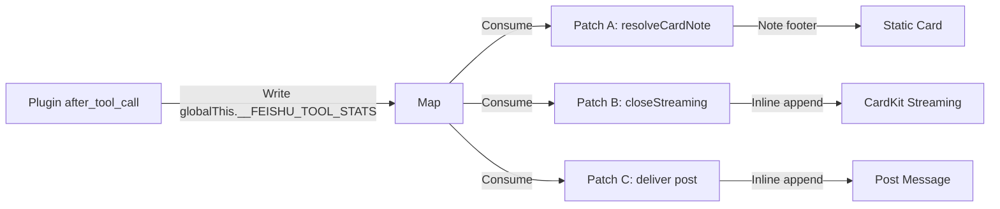
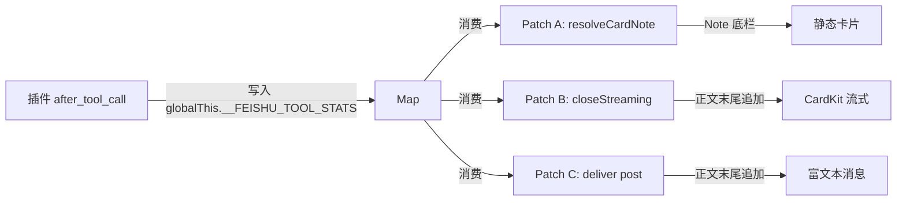

# 🛠️ OpenClaw Plugin: Tool Trace

Automatically append tool call statistics to the end of each reply.
Supports **Telegram / Webchat / Slack** text channels and **Feishu (Lark)** card/post channels.

---

## ✨ Example Output

**Telegram / Webchat:**
```
...reply content...

调用工具：web_search(3)，academic_search(2)
```

**Feishu Card (note footer):**
```
...reply content...
—————————————————
Agent: main | Model: deepseek-v4-flash | Provider: volcengine coding plan | 调用工具: web_search(3)
```

**Feishu Post / CardKit Streaming (inline):**
```
...reply content...

调用工具：web_search(3)，academic_search(2)
```

---

## 📦 Installation

### 1. Clone to local

```bash
git clone https://github.com/ffexis/openclaw-plugin-tool-trace.git
# Or symlink to OpenClaw's plugins path
ln -s /path/to/openclaw-plugin-tool-trace /path/to/openclaw/plugins/tool-trace
```

### 2. Enable the plugin

Configure in `openclaw.json`:

```json
{
  "plugins": {
    "entries": {
      "tool-trace": { "enabled": true }
    },
    "load": {
      "paths": ["/path/to/openclaw-plugin-tool-trace"]
    }
  }
}
```

### 3. Restart Gateway

```bash
# Find gateway PID and restart
kill -9 $(pgrep -f openclaw-gateway)
```

### 4. Verify

Send a tool-triggering message from TG / Webchat. The reply should end with `调用工具：xxx(y)`.

---

## 🦜 Feishu (Lark) Support

Feishu plugin uses a separate bundle for message sending, requiring an extra step.

### How it works (v2)



Three injection points in `monitor.account-*.js`:

| Patch | Location | Covers | Stats Display |
|:-----:|:--------:|:------:|:-------------:|
| **A** | `resolveCardNote` | Static card (non-streaming) | Note footer (grey text) |
| **B** | `closeStreaming` | CardKit streaming card | Inline at text end |
| **C** | `deliver` post branch | Post (rich text) message | Inline at text end |

### Run Patch

```bash
cd /path/to/openclaw-plugin-tool-trace
node patch-feishu.mjs
```

The script auto-locates the Feishu plugin's dist directory and:
1. Removes the old v1 patch from `sendCardFeishu` (if present)
2. Injects 3 new patches into `monitor.account-*.js`

Idempotent — safe to run multiple times.

**If auto-location fails, specify manually:**

```bash
# Find Feishu plugin location
find / -path "*/@openclaw/feishu/dist" -type d 2>/dev/null
```

### Restart Gateway

After patching, restart Gateway:

```bash
kill -9 $(pgrep -f openclaw-gateway)
```

### Verify

Send a tool-triggering message from Feishu. The reply should include tool statistics.

---

## 🏗️ Architecture

### Text Channels (TG / Webchat / Slack)

```
after_tool_call → runToolCounts Map → reply_payload_sending hook → inject at text end
```

### Feishu (v2 — Unified)

```
after_tool_call → globalThis.__FEISHU_TOOL_STATS[targetId]
                        ↓
          ┌─────────────┼─────────────┐
          ▼             ▼             ▼
   resolveCardNote  closeStreaming  deliver post
   (static card)   (CardKit stream) (post msg)
          │             │             │
          ▼             ▼             ▼
   Note footer    Inline append   Inline append
```

### Cross-turn Contamination Prevention

`before_dispatch` hook auto-clears previous turn's residual stats on Feishu inbound.

### Key Design: Serial Dispatch → First-Entry Consumption

Feishu channel dispatches are serialized — only one message is processed at a time.
The plugin stores stats in `globalThis.__FEISHU_TOOL_STATS` as a `Map<targetId, counts>`,
and the patches in `monitor.account` simply read the **first (and only)** entry.
No key matching is needed.

### Known Issue: Concurrent DM + Group Chat

If a DM and a group chat are processed simultaneously (within the same channel),
the stats Map may contain **two entries** at the moment a patch is triggered.
In this rare case, the patch reads the first entry, which may belong to the other conversation,
causing tool stats to appear on the wrong message.

**Current workaround:** Disable DM with the bot to prevent concurrent dispatches.

**Possible future solutions:**
1. **FIFO Queue:** Replace the Map with an ordered queue so stats are consumed in dispatch order.
2. **Run ID Tracking:** Include `runId` in the stats entry and match via available context.
3. **Per-Conversation Map:** Key by conversation ID (chat ID) instead of sessionKey tail.

---

## ⚙️ Customizing Exec Script Name Detection

The plugin detects `script.js`, `task.js`, and similar patterns by default.
To add custom scripts, modify the `EXEC_SCRIPT_PATTERNS` array in `index.mjs`:

```javascript
const EXEC_SCRIPT_PATTERNS = [
  { re: /my-script\.js/, name: "my-script.js" },
];
```

---

## 🤖 Special Thanks (AI Workforce)

While the project repository is single-authored, the grueling warfare against Feishu's nested JSON serialization and custom dispatcher isolation was fought alongside two tireless digital collaborators:

| DeepSeek-V4-Flash | Gemini Pro (LLM) |
| :--- | :--- |
| **The Resident Bootstrapper** <br>• Excavated the native `plugin-sdk`<br>• Monitored standard hook pipelines<br>• Executed localized code patching | **The Remote Think-Tank** <br>• Decoded Feishu's internal AST routing<br>• Formulated the pull-based injection strategy<br>• Blind-solved the fallback interactive card bug |

*Shoutout to the AI workforce for running the repetitive AST extractions and pipeline tracking so the Author didn't have to melt their own bank account on full-scale raw API tokens.*

---

## ⚠️ Test Status

**This code has NOT been fully tested.** The v2 architecture (migrating from `sendCardFeishu` to `monitor.account`) is a significant refactor that covers CardKit streaming, static cards, and post messages. While the design has been reviewed, the actual runtime behavior may differ. Please test thoroughly in your environment before relying on it in production.

---

## 📄 License

MIT

---

# 🛠️ OpenClaw 插件：Tool Trace

在每个回复末尾自动附上本轮调用的工具统计。
支持 **Telegram / Webchat / Slack** 等文本通道，以及 **飞书（Feishu / Lark）** 卡片/富文本通道。

---

## ✨ 效果

**Telegram / Webchat:**
```
...回复内容...

调用工具：web_search(3)，academic_search(2)
```

**飞书卡片（note 底栏）:**
```
...回复内容...
—————————————————
Agent: main | Model: deepseek-v4-flash | Provider: volcengine coding plan | 调用工具: web_search(3)
```

**飞书富文本 / CardKit 流式（正文末尾）:**
```
...回复内容...

调用工具：web_search(3)，academic_search(2)
```

---

## 📦 安装

### 1. 克隆到本地

```bash
git clone https://github.com/ffexis/openclaw-plugin-tool-trace.git
# 或者放在 OpenClaw 的 plugins 路径下
ln -s /path/to/openclaw-plugin-tool-trace /path/to/openclaw/plugins/tool-trace
```

### 2. 启用插件

在 `openclaw.json` 中配置：

```json
{
  "plugins": {
    "entries": {
      "tool-trace": { "enabled": true }
    },
    "load": {
      "paths": ["/path/to/openclaw-plugin-tool-trace"]
    }
  }
}
```

### 3. 重启 Gateway

```bash
# 找到 gateway PID 并重启
kill -9 $(pgrep -f openclaw-gateway)
```

### 4. 验证

从 TG / Webchat 发一条会调用工具的对话，回复末尾应出现 `调用工具：xxx(y)`。

---

## 🦜 飞书（Feishu / Lark）支持

飞书插件使用独立的 bundle 管理消息发送，因此多了一个额外步骤。

### 原理（v2）



在 `monitor.account-*.js` 中注入 3 个点：

| Patch | 位置 | 覆盖场景 | 统计显示位置 |
|:-----:|:----:|:--------:|:-----------:|
| **A** | `resolveCardNote` | 静态卡片（非流式） | Note 底栏（灰色小字） |
| **B** | `closeStreaming` | CardKit 流式卡片 | 正文末尾 |
| **C** | `deliver` post 分支 | 富文本（post）消息 | 正文末尾 |

### 执行 Patch

```bash
cd /path/to/openclaw-plugin-tool-trace
node patch-feishu.mjs
```

脚本会自动定位飞书插件的 dist 目录，并：
1. 移除 v1 旧 patch（`sendCardFeishu` 中的，如有）
2. 注入 3 个新 patch 到 `monitor.account-*.js`

幂等设计，重复运行安全。

**如脚本未能自动定位飞书路径，可手动指定：**

```bash
# 查看飞书插件实际位置
find / -path "*/@openclaw/feishu/dist" -type d 2>/dev/null
```

### 重启 Gateway

Patch 后需要重启 Gateway 使拦截代码生效：

```bash
kill -9 $(pgrep -f openclaw-gateway)
```

### 验证

从飞书发一条会调用工具的对话，回复中应包含工具统计信息。

---

## 🏗️ 架构

### 文本通道（TG / Webchat / Slack 等）

```
after_tool_call → runToolCounts Map → reply_payload_sending hook → 注入 text 末尾
```

### 飞书（v2 — 统一注入）

```
after_tool_call → globalThis.__FEISHU_TOOL_STATS[targetId]
                        ↓
          ┌─────────────┼─────────────┐
          ▼             ▼             ▼
   resolveCardNote  closeStreaming  deliver post
   (静态卡片)       (CardKit 流式)  (富文本消息)
          │             │             │
          ▼             ▼             ▼
   Note 底栏       正文末尾追加    正文末尾追加
```

### 跨轮防污染

`before_dispatch` hook 在飞书入站阶段自动清理上一轮的残留统计。

### 关键设计：串行处理 → 取第一条

飞书 channel 是串行处理的——同一时间只有一条消息被处理。
插件将统计信息存储在 `globalThis.__FEISHU_TOOL_STATS` 的 `Map<targetId, counts>` 中，
monitor.account 里的 patch 直接取**第一条（也是唯一一条）**记录，无需 key 匹配。

### 已知问题：单聊与群聊并发

如果单聊和群聊消息同时被处理（同一 channel 内），
stats Map 在 patch 被触发时可能包含**两条记录**。
这时 patch 读取第一条记录，可能导致工具统计显示在错误的消息上。

**当前解决方案：** 禁用机器人单聊，防止并发 dispatch。

**可能的未来方案：**
1. **FIFO 队列：** 用有序队列替代 Map，按 dispatch 顺序消费统计。
2. **Run ID 追踪：** 在 stats 条目中包含 `runId`，通过可用上下文匹配。
3. **按会话 ID 分桶：** 用聊天 ID 而非 sessionKey 尾巴做 key。

---

## ⚙️ 自定义 exec 脚本名识别

插件默认识别 `script.js`、`task.js` 等常见模式。
如需添加自定义脚本，修改 `index.mjs` 中的 `EXEC_SCRIPT_PATTERNS` 数组：

```javascript
const EXEC_SCRIPT_PATTERNS = [
  { re: /my-script\.js/, name: "my-script.js" },
];
```

---

## 🤖 特别致谢（AI 工作组）

虽然项目仓库是单人创作，但对抗飞书嵌套 JSON 序列化和自定义调度器隔离的艰苦战争，是由两位不知疲倦的数字合作者并肩作战：

| DeepSeek-V4-Flash | Gemini Pro (LLM) |
| :--- | :--- |
| **驻场启动器** <br>• 挖掘原生 `plugin-sdk`<br>• 监控标准钩子管道<br>• 执行本地化代码修补 | **远程智囊团** <br>• 解码飞书内部 AST 路由<br>• 制定拉取式注入策略<br>• 盲解回退交互卡片 bug |

*感谢 AI 工作组执行重复的 AST 提取和管道追踪，让作者不用烧掉自己的账户来支付全量原始 API token。*

---

## ⚠️ 测试状态

**此代码尚未经过完整测试。** v2 架构（从 `sendCardFeishu` 迁移到 `monitor.account`）是一次重大重构，覆盖了 CardKit 流式、静态卡片和富文本消息。虽然设计经过了讨论和审查，但实际运行时行为可能与预期有差异。请在生产环境依赖此代码前充分测试。

---

## 📄 License

MIT
